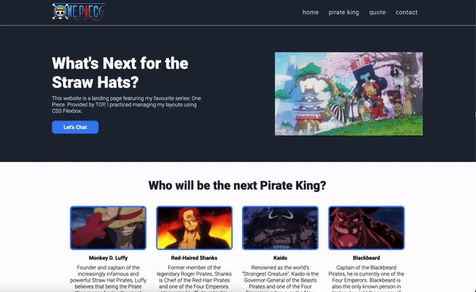

# One Piece Landing Page
This mini project is from The Odin Project.

They provided 2 images: one displaying the complete website and the other shared some details regarding the fonts and colours used. Since the website had some dummy images and being the major One Piece fan I am, I had to add my own lil twist!

## How It's Made:

**Tech used:** HTML & CSS

Although the page is simple and static, I feel so much more confident using Flexbox for my layouts. I plan on revisiting this mini project to make it responsive for both tablets and mobile phones.
